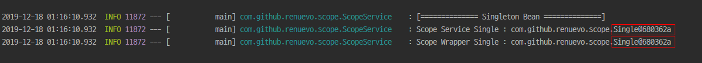
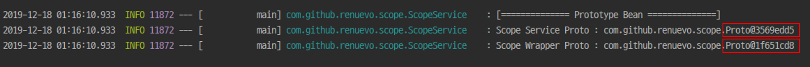

# Spring Scope
*Spring Bean을 생성시 적용되는 Scope에 대해 알아보려 합니다*

해당 포스팅은 내부적 구현 요소의 대해 설명에 집중하며 Scope의 일반적인 사용법을 보시려면 
:point_right: [baeldung - spring-bean-scopes](https://www.baeldung.com/spring-bean-scopes)  

Spring Bean의 Scope는 크게 2가지가 존재합니다  
Spring의 내부 `ConfigurableBeanFactory`를 보면 `singleton`과 `prototype` 2가지 속성을 나타내고 있습니다  
```java
public interface ConfigurableBeanFactory extends HierarchicalBeanFactory, SingletonBeanRegistry {

	/**
	 * Scope identifier for the standard singleton scope: "singleton".
	 * Custom scopes can be added via {@code registerScope}.
	 * @see #registerScope
	 */
	String SCOPE_SINGLETON = "singleton";

	/**
	 * Scope identifier for the standard prototype scope: "prototype".
	 * Custom scopes can be added via {@code registerScope}.
	 * @see #registerScope
	 */
	String SCOPE_PROTOTYPE = "prototype";
...
}
```
<br/>


일반 적으로 생성되는 빈들은 모두 `Singleton`으로 생성되게 됩니다  
즉 아래 두개의 Bean들은 서로 동일하게 Singleton으로 생성되게 됩니다  
```java
@Component
public class Single {}


@Component
@Scope("singleton")
public class Single {}
```
`Singleton`으로 생성하게 되면 어디서나 1개의 인스턴스를 참조하여 사용하게 됩니다  
<br/>

```java
@Component
public class Single {}
```
예를 들어 다음 같이 Singleton Bean을 하나 만들고  

<br/>

```java
@Component
@AllArgsConstructor
public class ScopeWrapper {

    @Getter
    Single single;

    ...
}
```

<br/>

WrapperClass를 하나 만들어서 해당 Bean을 Autowired DI 해줍니다
```java
@Slf4j
@Service
@AllArgsConstructor
public class ScopeService {
    private final ScopeWrapper scopeWrapper;
    private final Single single;

    public void scopeTest() {
        log.info("[============== Singleton Bean ==============]");
        log.info("Scope Service Single : " + single);
        log.info("Scope Wrapper Single : " + scopeWrapper.getSingle());
    }
}

```
그 후 ScopeService 만들어서 각각의 Bean을 DI하고 각각의 Single 인스턴스를 출력하면 다음과 같습니다  


`Singleton`으로 당연하게 같은 Instance를 확인 할 수 있습니다  

<br/>
---

`Prototype`은 매번 새로운 Instance를 생성하여 Bean의 생명주기가 필요할 때 사용되게 됩니다  

```java
@Component
@Scope("prototype")
public class Proto {}
```
Prototype Bean을 하나 생성하고

<br/>

```java
@Component
@AllArgsConstructor
public class ScopeWrapper {

    @Getter
    Proto proto;
    ...
}
```
아까와 같이 WrapperClass에 Propotype Bean을 DI해줍니다  

<br/>

```java
@Slf4j
@Service
@AllArgsConstructor
public class ScopeService {
    private final ScopeWrapper scopeWrapper;
    private final Proto proto;

    public void scopeTest() {
        log.info("[============== Prototype Bean ==============]");
        log.info("Scope Service Proto : " + proto);
        log.info("Scope Wrapper Proto : " + scopeWrapper.getProto());
    }
}

```
ScopeService 아까와 같이 구성해서 출력하면 다음과 같습니다  

`Prototype`으로 서로 다른 Instance를 확인 할 수 있습니다  

