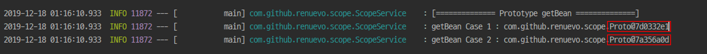
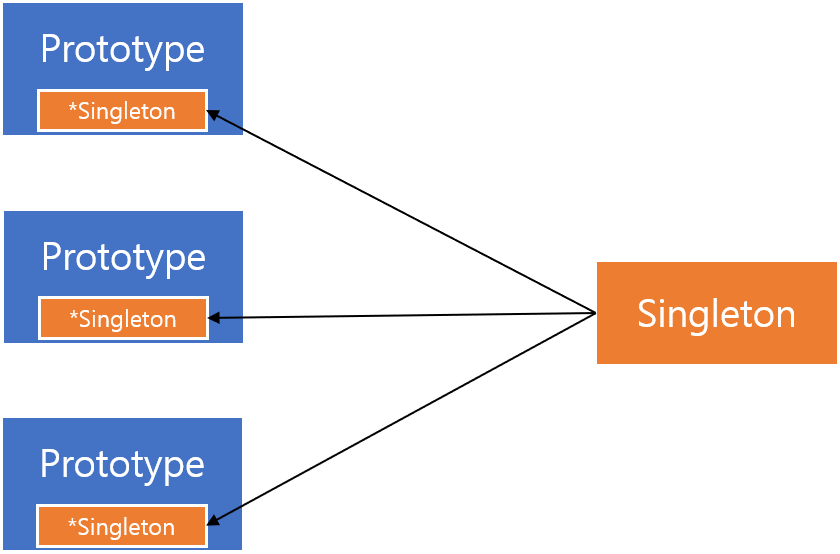
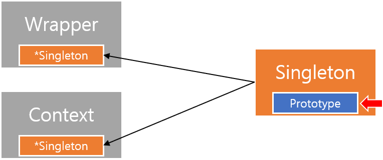
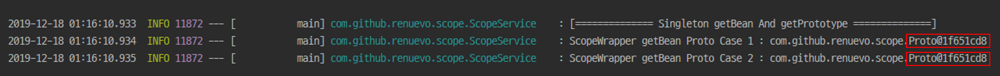
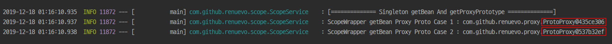
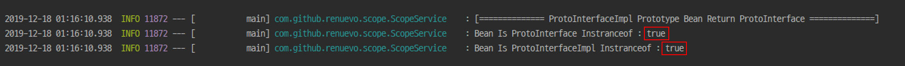
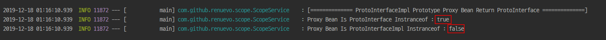
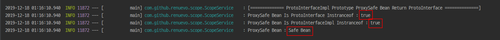

# Spring Scope
*Spring Bean을 생성시 적용되는 Scope에 대해 알아보려 합니다*
아래 모든 소스의 제 [Github](https://github.com/renuevo/spring-boot-in-action/tree/master/spring-boot-scope-in-action)에서 확인 하실 수 있습니다  

해당 포스팅은 내부적 구현 요소의 대해 설명에 집중하며 Scope의 일반적인 사용법을 보시려면 
:point_right: [baeldung - spring-bean-scopes](https://www.baeldung.com/spring-bean-scopes)  

Spring Bean의 Scope는 크게 2가지가 존재합니다  
Spring의 내부 `ConfigurableBeanFactory`를 보면 `singleton`과 `prototype` 2가지 속성을 나타내고 있습니다  
```java
public interface ConfigurableBeanFactory extends HierarchicalBeanFactory, SingletonBeanRegistry {

	/**
	 * Scope identifier for the standard singleton scope: "singleton".
	 * Custom scopes can be added via {@code registerScope}.
	 * @see #registerScope
	 */
	String SCOPE_SINGLETON = "singleton";

	/**
	 * Scope identifier for the standard prototype scope: "prototype".
	 * Custom scopes can be added via {@code registerScope}.
	 * @see #registerScope
	 */
	String SCOPE_PROTOTYPE = "prototype";
...
}
```
<br/>


일반 적으로 생성되는 빈들은 모두 `Singleton`으로 생성되게 됩니다  
즉 아래 두개의 Bean들은 서로 동일하게 Singleton으로 생성되게 됩니다  
```java
@Component
public class Single {}


@Component
@Scope("singleton")
public class Single {}
```
`Singleton`으로 생성하게 되면 어디서나 1개의 인스턴스를 참조하여 사용하게 됩니다  
<br/>

```java
@Component
public class Single {}
```
예를 들어 다음 같이 Singleton Bean을 하나 만들고  

<br/>

```java
@Component
@AllArgsConstructor
public class ScopeWrapper {

    @Getter
    Single single;

    ...
}
```
WrapperClass를 하나 만들어서 해당 Bean을 Autowired DI 해줍니다

<br/>

```java
@Slf4j
@Service
@AllArgsConstructor
public class ScopeService {
    private final ScopeWrapper scopeWrapper;
    private final Single single;

    public void scopeTest() {
        log.info("[============== Singleton Bean ==============]");
        log.info("Scope Service Single : " + single);
        log.info("Scope Wrapper Single : " + scopeWrapper.getSingle());
    }
}

```
그 후 ScopeService 만들어서 각각의 Bean을 DI하고 각각의 Single 인스턴스를 출력하면 다음과 같습니다  


`Singleton`으로 당연하게 같은 Instance를 확인 할 수 있습니다  

<br/>
---

`Prototype`은 매번 새로운 Instance를 생성하여 Bean의 생명주기가 필요할 때 사용되게 됩니다  

```java
@Component
@Scope("prototype")
public class Proto {}
```
Prototype Bean을 하나 생성하고

<br/>

```java
@Component
@AllArgsConstructor
public class ScopeWrapper {

    @Getter
    Proto proto;
    ...
}
```
아까와 같이 WrapperClass에 Propotype Bean을 DI해줍니다  

<br/>

```java
@Slf4j
@Service
@AllArgsConstructor
public class ScopeService {
    private final ScopeWrapper scopeWrapper;
    private final Proto proto;

    public void scopeTest() {
        log.info("[============== Prototype Bean ==============]");
        log.info("Scope Service Proto : " + proto);
        log.info("Scope Wrapper Proto : " + scopeWrapper.getProto());
    }
}

```
ScopeService 아까와 같이 구성해서 출력하면 다음과 같습니다  

`Prototype`으로 서로 다른 Instance를 확인 할 수 있습니다   

<br/>

```java
@Slf4j
@Service
@AllArgsConstructor
public class ScopeService {

    private final ApplicationContext ctx;

    public void scopeTest() {
        log.info("[============== Prototype getBean ==============]");
        log.info("getBean Case 1 : " + ctx.getBean("proto"));
        log.info("getBean Case 2 : " + ctx.getBean("proto"));
    }
}
```

`ApplicationContext`를 통해 getBean으로 Proto를 가져와도 다른 Instance를 가져오는 것을 확인 할 수 있습니다  

<br/>

---

위에 예제들을 통해 `Singleton`과 `Prototype`의 특성을 살펴 보았습니다  
이 스코프 특성들은 각각 사용하거나 Prototype에서 Singleton을 가지고 사용하는 것에는 문제가 없습니다  

  

<br/>
<br/>

**반대로 Singleton에서 Prototype을 가지고 있는 경우에는 의도한 것과 다른 결과를 낼 수 있습니다**  
  

이미 Singleton으로 생성되는 시점에 Prototype이 생성되어 들어 오기 때문에  
**Singleton 내부의 Prototype을 호출해게 되면 매번 같은 값을 가져오게 됩니다**  

```java
@Slf4j
@Service
@AllArgsConstructor
public class ScopeService {

    private final ApplicationContext ctx;

    public void scopeTest() {
        log.info("[============== Singleton getBean And getPrototype ==============]");
        log.info("ScopeWrapper getBean Proto Case 1 : " + ctx.getBean(ScopeWrapper.class).getProto());
        log.info("ScopeWrapper getBean Proto Case 2 : " + ctx.getBean(ScopeWrapper.class).getProto());
    }
}
```

  
다음과 같이 같은 Instance가 return 된걸 확인 할 수 있습니다  
**그럼 원래 처럼 매번 다른 Instance를 받아 오려면 어떻게 해야 할까요?**  

<br/>

이러한 문제를 해결하기 위해 Spring에서는 `ProxyMode`를 제시하고 있습니다  
```java
@Component
@Scope(value = "prototype", proxyMode = ScopedProxyMode.TARGET_CLASS)
public class ProtoProxy {}


@Component
@AllArgsConstructor
public class ScopeWrapper {
    ...

    @Getter
    ProtoProxy protoProxy;
}
```
위와 같이 Prototype에 `ProxyMode`를 추가 하고 Wrapper에 DI 후 출력해 봅니다   

```java
@Slf4j
@Service
@AllArgsConstructor
public class ScopeService {

    private final ApplicationContext ctx;

    public void scopeTest() {
        log.info("[============== Singleton getBean And getProxyPrototype ==============]");
        log.info("ScopeWrapper getBean Proxy Proto Case 1 : " + ctx.getBean(ScopeWrapper.class).getProtoProxy());
        log.info("ScopeWrapper getBean Proxy Proto Case 2 : " + ctx.getBean(ScopeWrapper.class).getProtoProxy());
    }
}
```
  
**`ProxyMode`로 우회해서 다음과 같이 원하는 값을 얻어 낼 수 있었습니다**  

<br/>

참고로 `request` or `session`과 같은 scope도 이런 `ProxyMode`를 구현되어 있습니다  

```java
@Target({ElementType.TYPE, ElementType.METHOD})
@Retention(RetentionPolicy.RUNTIME)
@Documented
@Scope(WebApplicationContext.SCOPE_SESSION)
public @interface SessionScope {

	/**
	 * Alias for {@link Scope#proxyMode}.
	 * <p>Defaults to {@link ScopedProxyMode#TARGET_CLASS}.
	 */
	@AliasFor(annotation = Scope.class)
	ScopedProxyMode proxyMode() default ScopedProxyMode.TARGET_CLASS;
}
```
```java
@Target({ElementType.TYPE, ElementType.METHOD})
@Retention(RetentionPolicy.RUNTIME)
@Documented
@Scope(WebApplicationContext.SCOPE_REQUEST)
public @interface RequestScope {

	/**
	 * Alias for {@link Scope#proxyMode}.
	 * <p>Defaults to {@link ScopedProxyMode#TARGET_CLASS}.
	 */
	@AliasFor(annotation = Scope.class)
	ScopedProxyMode proxyMode() default ScopedProxyMode.TARGET_CLASS;

}
```

---

다음은 마지막으로 `Interface`와 `ProxyMode`를 통한 `Bean 생성시` 유의해야할 사항에 대해 알아 보겠습니다  

```java
public interface ProtoInterface {}

public class ProtoInterfaceImpl implements ProtoInterface {
    @Getter
    String name;

    public ProtoInterfaceImpl() {}

    public ProtoInterfaceImpl(String name) {
        this.name = name;
    }
}
```
`Interface`를 생성하고 구현체인 `ProfoInterfaceImpl`을 생성하였습니다  
<br/>

```java

@Configuration
public class ProtoInterFaceBean {

    @Bean(name = "ProtoInterfaceProxy")
    @Scope(value = "prototype", proxyMode = ScopedProxyMode.TARGET_CLASS)
    public ProtoInterface getProtoInterfaceProxyBean() {
        return new ProtoInterfaceImpl();
    }

    @Bean(name = "ProtoInterface")
    @Scope(value = "prototype")
    public ProtoInterface getProtoInterfaceBean() {
        return new ProtoInterfaceImpl();
    }
}
```
그리고 다음과 같이 각각 일반 Prototype Bean 한개와 ProxyMode의 Bean을 생성합니다  
**Bean에서는 return은 Interface로 하지만 실제적으론 구현체인 ProtoInterfaceImpl을 생성하여 return 하였습니다**  

<br/>

```java
@Slf4j
@Service
public class ScopeService {
    
    @Autowired
    @Qualifier("ProtoInterface")
    private  ProtoInterface protoInterface;

    @Autowired
    @Qualifier("ProtoInterfaceProxy")
    private  ProtoInterface protoInterfaceProxy;

    public void scopeTest() {
                log.info("[============== ProtoInterfaceImpl Prototype Bean Return ProtoInterface ==============]");
                log.info("Bean Is ProtoInterface Instranceof : " + (protoInterface instanceof ProtoInterface));
                log.info("Bean Is ProtoInterfaceImpl Instranceof : " + (protoInterface instanceof ProtoInterfaceImpl));
                System.out.println();
        
                log.info("[============== ProtoInterfaceImpl Prototype Proxy Bean Return ProtoInterface ==============]");
                log.info("Proxy Bean Is ProtoInterface Instranceof : " + (protoInterfaceProxy instanceof ProtoInterface));
                log.info("Proxy Bean Is ProtoInterfaceImpl Instranceof : " + (protoInterfaceProxy instanceof ProtoInterfaceImpl));
                System.out.println();
    }
}

```

그 다음 다음과 같이 각각의 Bean을 DI 받아서 `instanceof`로 확인하면 어떻게 될까요?  

  
일반적으로 생성된 Bean의 경우 당연하게도 interface와 구현체 모두 `true`로 확인이 가능합니다  

<br/>

  
하지만 Proxy의 한번 경유하는 특성으로 `Return Type`과 같은 interface에서만 `true`로 나온 것을 확인할 수 있습니다  

<br/>

이러한 문제로 ProxyMode가 걸린 Bean의 경우 주의가 필요합니다  

```java
@Configuration
public class ProtoInterFaceBean {
    ...

    @Bean(name = "ProtoInterfaceProxySafe")
    @Scope(value = "prototype")
    public ProtoInterfaceImpl getProtoInterfaceProxySafeBean() {
        return new ProtoInterfaceImpl("Safe Bean");
    }
}

```
다음과 같이 간단하게 `Return Type`을 맞춰 주는 것으로 해결 할 수 있습니다  

  

<br/>

---

이것으로 Bean의 생명주기 Scope의 대한 포스팅을 마무리 합니다  

  

Scope와 관련해서 이것저것 애매한 사항이 많았는데  
이렇게 한번 정리하면서 소스를 짜고 보니 맘속까지 후련해 졌습니다  
이 포스팅이 저와 같은 궁금증을 가지신 분들에서 도움이 되길 바립니다  